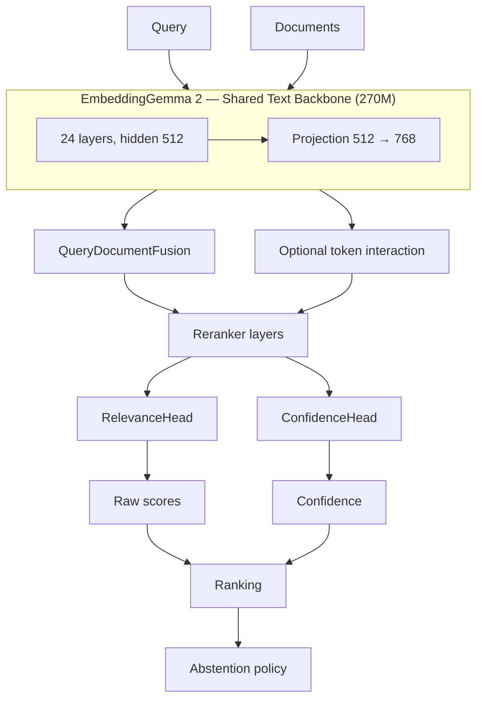

# EmbeddingGemma2-Reranker

A neural cross-encoder reranker built on Google's **EmbeddingGemma 2 270M** text tower.

EmbeddingGemma produces embeddings: one vector per item, compared by cosine
similarity. That is fast and indexable, but it throws away token-level alignment —
the model cannot see that a document mentions *JWT* **and** *expiration* in the
right relationship. This project adds the missing half: a genuine
query–document interaction architecture that scores candidates directly.

```
EMBEDDINGGEMMA 2 TEXT BACKBONE        (frozen, unchanged, 270M)
        + QUERY REPRESENTATION
        + DOCUMENT REPRESENTATION
        + QUERY-DOCUMENT FUSION      Q, D, Q⊙D, |Q−D| → learned projection
        + OPTIONAL TOKEN INTERACTION cross-attention over token states
        + TRAINABLE RERANKER LAYERS   Norm → FFN → Residual
        + RELEVANCE HEAD              one raw logit per pair
        + OPTIONAL CONFIDENCE / ABSTENTION
        + RANKING API
```

> **Current status: architecture implemented, reranker training and benchmarking pending.**
> No trained checkpoint ships with this repository. Nothing here claims an
> improvement over EmbeddingGemma retrieval — see [Current Status](#current-status).

This copy includes runtime and training fixes; see [FIXES.md](FIXES.md) for
verification commands and the changes. Model weights are downloaded from Hugging
Face on first use and are not bundled with the source archive.

---

## Overview

| | |
|---|---|
| Source model (Ollama) | [`embeddinggemma-2:270m`](https://ollama.com/library/embeddinggemma-2) |
| Official checkpoint | [`google/embeddinggemma-2`](https://huggingface.co/google/embeddinggemma-2) |
| Official docs | [EmbeddingGemma 2 model card](https://ai.google.dev/gemma/docs/embeddinggemma/model_card_2) |
| Target modalities | text + code (270M tag is text-only) |
| Languages | 100+ (inherited; no English-only preprocessing) |

## Why reranking?

Retrieval and reranking solve different problems.

**Embedding retrieval** encodes the query and each document *independently* into a
768-d vector, then compares them. Each document is encoded once and cached, so
scanning a million-document corpus is cheap. But two documents with identical
vectors are indistinguishable no matter how their words relate to the query.

**Reranking** looks at the query and document *together*. A cross-encoder can
learn that a document answers the question, not merely that it shares vocabulary
with it. The cost is that it must re-run per (query, document) pair — so it runs
as **stage 2**, re-scoring the ~50–200 candidates stage 1 produced.

This project implements both, so the difference is measurable rather than asserted.

## Source model analysis

Full findings, with verified values separated from assumptions, are in
[`docs/source_model_analysis.md`](docs/source_model_analysis.md). Summary of what
was actually observed:

| Property | Value | Where from |
|---|---|---|
| Text hidden size | 512 | `text_config.hidden_size` |
| Text output dim | 768 | `text_config.embedding_dim` |
| Layers | 24 (20 sliding + 4 full, with per-layer overrides at 5/11/17/23) | `text_config.layer_types` |
| Attention heads / KV heads | 4 / 2 | `text_config` |
| Head dim | 256 (512 on 4 layers) | `head_dim`, `per_layer_config` |
| FFN / activation | 2048 / `gelu_pytorch_tanh` | `text_config` |
| Norm | RMSNorm, eps 1e-6 | `rms_norm_eps` |
| RoPE | theta 1e4 sliding / 1e6 full | `rope_parameters` |
| Vocabulary | 262 144 | `text_config.vocab_size` |
| Pooling | mean, `include_prompt=true` | `1_Pooling/config.json` |
| Similarity | cosine | `config_sentence_transformers.json` |
| Checkpoint dtype | bfloat16 | `config.json` |
| Parameters | 270M text / 170M vision / 300M audio = 740M | model card |
| Ollama `270m` tag | 378 MB, 256K context, **text only** | Ollama library page |
| License | Apache 2.0 | model card |

Inspect it yourself:

```bash
python scripts/inspect_source.py --model google/embeddinggemma-2
python scripts/inspect_source.py --config-only     # no weight download
```

### What an Ollama artifact actually contains

An Ollama model is **not** Python training source. `ollama pull` fetches a GGUF
blob plus tokenizer/template metadata; `ollama show --modelfile` prints the
`Modelfile` used to build the image (`FROM`, `PARAMETER`, `TEMPLATE`, `LICENSE`)
— not a training repository. There is no Transformers `config.json` and no module
tree inside it.

So the architecture here was built from the **upstream Hugging Face checkpoint**,
which is what Ollama packages, cross-referenced with the Ollama library page for
tag-level facts.

## Architecture



Full diagrams, module map and sequence chart: [`docs/architecture.md`](docs/architecture.md).

The backbone is **shared** by `QueryEncoder` and `DocumentEncoder` — one 270M tower
in memory, not two. The native 768-d embedding is still computed, but only so the
bi-encoder baseline and hard-negative miner can use it. The relevance score itself
comes from the learned head.

### Bi-encoder baseline

Implemented in `evaluation/baseline.py`: query embedding, document embedding,
cosine similarity. This is the control condition, not the product.

### Learned reranker

1. **Encode** — query once (tiled across candidates), documents batched.
2. **Fuse** — `[Q, D, Q⊙D, |Q−D|]` through a learned projection (`elementwise`,
   the default). Other modes: `none`, `concatenate`, `dot`, `token`.
3. **Interact** (optional) — cross-attention over token states plus a
   query–document interaction matrix, aggregated to a vector.
4. **Refine** — 2 pre-norm residual blocks (`reranker_dim: 512`).
5. **Score** — `RelevanceHead` emits one **raw, unbounded** logit. No sigmoid
   during training; calibration is applied only if you ask for it.
6. **Rank & abstain** — stable descending sort; thresholds are policy, applied
   outside the forward pass.

### Interaction layers

`interaction.enabled: false` by default. Token interaction costs `O(T_q · T_d)`
and at long lengths can exceed the backbone itself. Enable it for short queries
where the extra expressiveness matters.

## Training

### Data formats

Plain UTF-8 JSONL. **No dataset is committed to this repository.**

Pairwise:
```json
{"query": "What is Python?", "positive": "Python is a programming language...", "negative": "The Pacific Ocean is..."}
```

Multi-candidate with graded relevance:
```json
{"query": "Authentication configuration", "documents": ["A", "B", "C"], "relevance": [0, 2, 1]}
```

With external teacher scores (never fabricated by this project):
```json
{"query": "...", "documents": ["...", "..."], "teacher_scores": [8.2, 1.3]}
```

```bash
python scripts/train_reranker.py --config configs/reranker.yaml \
    --train-file data/train.jsonl --output-dir runs/exp1
python scripts/train_reranker.py --smoke-test     # tiny stub, no download
```

### Modes

| Mode | Trainable | Use |
|---|---|---|
| `head_only` | relevance + confidence heads | cheapest probe |
| `reranker_only` | fusion + interaction + layers + heads | **default** |
| `lora` | the above + LoRA on the backbone | memory-constrained |
| `full` | everything | explicit opt-in only |

`full` raises `FullFinetuneNotConfirmed` unless you pass
`--allow-full-finetune`. Trainable, frozen and total parameter counts are printed
from the actual tensors.

### Hard negatives

Optional. The **original bi-encoder** retrieves top-k candidates, positives are
removed, the remainder becomes hard negatives.

```bash
python scripts/train_reranker.py --config configs/lora.yaml \
    --train-file data/train.jsonl --corpus-file data/corpus.jsonl \
    --mine-hard-negatives --num-hard-negatives 2
```

A `--corpus-file` is required; mining stats (including how many examples ended up
with no negative) are written to `mined_train.jsonl.stats.json`.

### Losses

`bce`, `pairwise_margin`, `listwise`, `mse`, `distill_kl`. Select with
`training.loss`. `distill_kl` requires real `teacher_scores` in the data and
**errors out** rather than inventing a target.

## Evaluation

```bash
python scripts/evaluate_reranker.py --checkpoint runs/exp1 --eval-file data/eval.jsonl --latency
```

Reports, on identical inputs: **MRR**, **MRR@k**, **NDCG**, **NDCG@k**,
**Recall@k**, **Precision@k**, **MAP**, **Hits@k**, **Pairwise accuracy**,
**Top-1 accuracy** — for the reranker, for the cosine baseline, and the delta.
Calibration (ECE, Brier, NLL, reliability bins) when a confidence head exists.
`bootstrap_ci` is available for significance testing on small query sets.

Metrics are computed against the **full** ranking and only read the first `k`
entries, avoiding the truncation/label-length mismatch class of bug.

## Inference

```python
from embeddinggemma_reranker import (
    EmbeddingGemma2RerankerInference, RerankerConfig, build_reranker,
)

model = build_reranker(RerankerConfig.from_yaml("configs/reranker.yaml"))
reranker = EmbeddingGemma2RerankerInference(model)

response = reranker.rerank(
    query="How do I configure authentication?",
    documents=["Document A...", "Document B...", "Document C..."],
)
```

```json
{
  "ranking": [1, 2, 0],
  "results": [
    {"index": 1, "rank": 1, "score": 7.41, "calibrated_score": 0.9994, "confidence": 0.88},
    {"index": 2, "rank": 2, "score": 5.18, "calibrated_score": 0.9945, "confidence": 0.72},
    {"index": 0, "rank": 3, "score": -0.82, "calibrated_score": 0.3049, "confidence": 0.84}
  ],
  "insufficient_confidence": false
}
```

(Those scores are **illustrative format**, not measured output.)

Long documents are chunked and aggregated (`max` / `mean` / `top_k_mean`); any
truncation is reported via `chunked`, `num_chunks` and `truncated_documents`, never
silent.

### Confidence and abstention

Confidence comes from a head that sees the ranking representation plus real score
statistics (top-1, top1−top2 margin, spread) — not an arbitrary number.
Thresholds (`minimum_relevance`, `minimum_margin`, `minimum_confidence`) are
**policy**, applied after the network and never inside the loss. When nothing
clears them, `insufficient_confidence: true` is returned rather than pretending the
best candidate is relevant.

## Code reranking

Code is ordinary text to this architecture — no code-specific tokenizer.

```bash
python examples/code_rerank.py
```

The upstream `CodeRetrieval` prompt is used:
`"task: code retrieval | query: "` on the query side, `title: … | text: …` on the
document side.

## Performance

**Benchmark status: NOT YET BENCHMARKED.**

No trained reranker has been evaluated in this repository. There is no measured
MRR, NDCG, latency or throughput number to report, and no claim that this model
outperforms EmbeddingGemma cosine retrieval. Upstream EmbeddingGemma 2 published
MTEB figures are for the *embedding* model, not for this reranker.

Get the numbers yourself:

```bash
python scripts/model_stats.py --config configs/reranker.yaml   # real parameter counts
python scripts/evaluate_reranker.py --checkpoint runs/exp1 --eval-file data/eval.jsonl
```

## Limitations

- **Untrained.** Architecture only; no shipped checkpoint.
- **Cross-encoder cost.** Per-(query, document) forward pass — a second-stage tool,
  not a corpus-wide index.
- **Text-only.** The 270M tag carries no vision or audio; multimodal reranking is a
  roadmap item, not implemented.
- **Score scale is not calibrated out of the box.** Raw logits are unbounded by
  design; thresholds are deployment-specific.
- **Token interaction is optional and can be expensive** at long lengths.
- **Hard-negative mining needs a corpus**, and quality depends on it.
- **Tests use a stub backbone.** No test downloads weights, so the suite validates
  logic and shapes, not real-model behaviour.

## Current Status

| Item | State |
|---|---|
| Source inspection | done (`docs/source_model_analysis.md`) |
| Architecture | implemented |
| Training pipeline | implemented, **not yet run on real data** |
| Trained checkpoint | **none** |
| Benchmark results | **none** |
| Tests | tiny stub backbone, no downloads |

To reproduce the claims, in order: inspect the source, train on your own data,
then evaluate against the baseline.

## Roadmap

- [ ] Train and benchmark on a public reranking set (MS MARCO, BEIR)
- [ ] Distil from a larger cross-encoder via `teacher_scores`
- [ ] Token-interaction cost benchmarks at realistic lengths
- [ ] Quantised inference (int8 backbone) for on-device stage 2
- [ ] Multimodal reranking using the 740M checkpoint
- [ ] ONNX export for the cross-encoder path

## Installation

```bash
git clone https://github.com/burkiuze/EmbeddingGemma2-Reranker.git
cd EmbeddingGemma2-Reranker
pip install -r requirements.txt
pip install -e .
```

Optional extras: `pip install -e ".[lora]"` for PEFT/LoRA, `".[dev]"` for pytest.

For CPU-only PyTorch:
```bash
pip install torch --index-url https://download.pytorch.org/whl/cpu
```

## Tests

```bash
python -m compileall .
pytest
```

The suite uses a tiny stub backbone, so it runs in seconds with no network access
and no multi-hundred-MB download. It covers fusion arithmetic, token interaction,
head shapes and unboundedness, every loss, variable candidate counts, document
masks, ranking order and stability, chunk aggregation, parameter accounting,
empty-candidate validation, batching, confidence policy and abstention.

**What the tests do not do:** assert semantic ranking quality. An untrained stub
has no opinions about relevance, and a passing suite says nothing about whether
this reranker is good. That question needs training data and a real benchmark.

## Repository layout

```
EmbeddingGemma2-Reranker/
├── configs/           base.yaml, reranker.yaml, lora.yaml, training.yaml
├── docs/              architecture.md, source_model_analysis.md
├── embeddinggemma_reranker/
│   ├── backbone.py        EmbeddingGemma 2 text tower adapter
│   ├── pooling.py         mean/cls/max/last/attention
│   ├── fusion.py          QueryDocumentFusion
│   ├── interaction.py     token-level cross-attention, late interaction
│   ├── reranker_layers.py residual reranker blocks
│   ├── heads.py           RelevanceHead, ConfidenceHead
│   ├── model.py           QueryEncoder, DocumentEncoder, full model
│   ├── policy.py          ranking + abstention
│   ├── statistics.py      real parameter counting
│   ├── inference.py       chunking + rerank API
│   └── config.py
├── training/          dataset, collator, hard_negatives, losses, trainer, train
├── evaluation/        metrics, baseline, calibration, evaluate
├── scripts/           inspect_source, model_stats, train_reranker, evaluate_reranker
├── examples/          rerank_documents, semantic_search_rerank, code_rerank
└── tests/             unit tests on a stub backbone
```

## License and attribution

**Apache License 2.0** — see [`LICENSE`](LICENSE). The repository's existing
license is preserved.

### Base model

**EmbeddingGemma 2** is developed by **Google DeepMind** and released under the
**Apache License 2.0**.
- Model card: <https://ai.google.dev/gemma/docs/embeddinggemma/model_card_2>
- Checkpoint: <https://huggingface.co/google/embeddinggemma-2>
- Ollama package: <https://ollama.com/library/embeddinggemma-2>

> **EmbeddingGemma2-Reranker is an independent project built using EmbeddingGemma 2
> as its base model.** It is not affiliated with, endorsed by, or an official
> release of Google DeepMind. All reranking-specific modules — fusion, token
> interaction, reranker layers, relevance and confidence heads, training and
> evaluation code — were written for this project and are not part of the original
> model.

Follow EmbeddingGemma 2's license and attribution terms when redistributing the
model or derived weights.

## References

- [EmbeddingGemma 2 model card](https://ai.google.dev/gemma/docs/embeddinggemma/model_card_2)
- [google/embeddinggemma-2 on Hugging Face](https://huggingface.co/google/embeddinggemma-2)
- [embeddinggemma-2 on Ollama](https://ollama.com/library/embeddinggemma-2)
