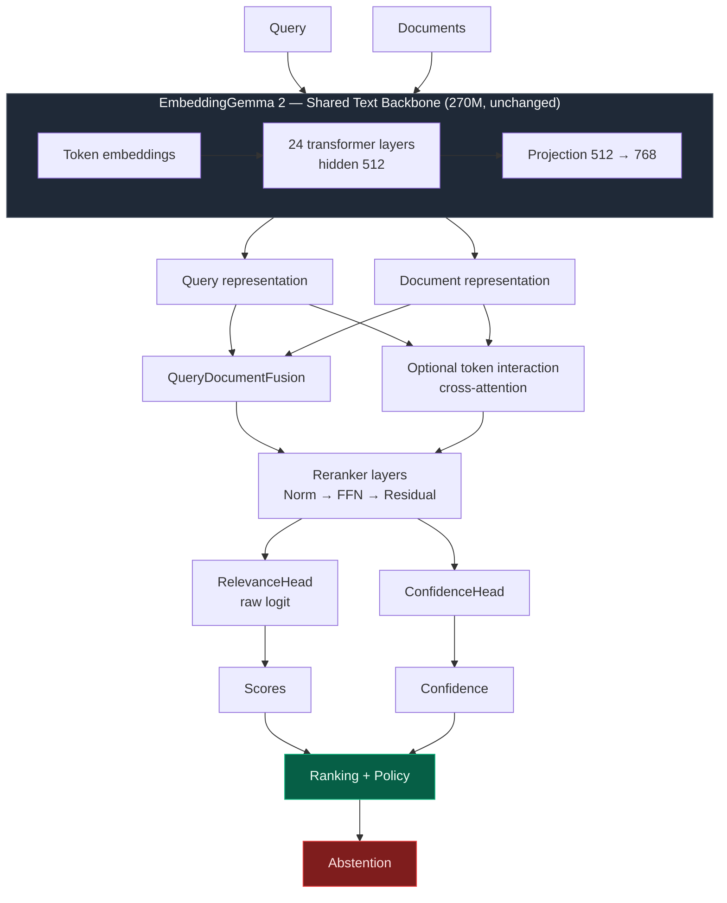
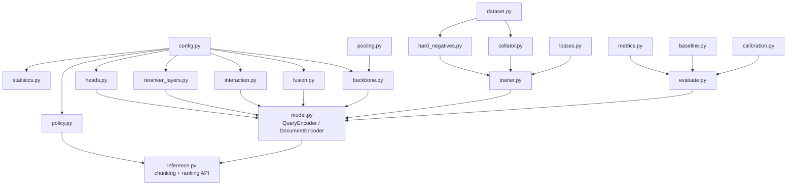
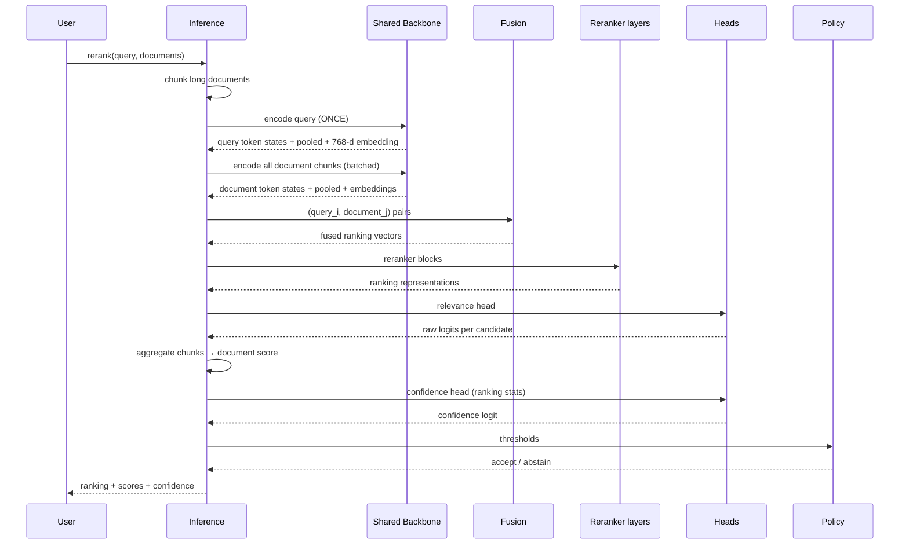
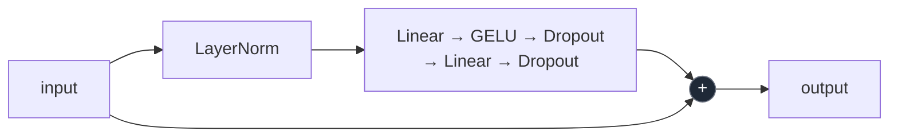
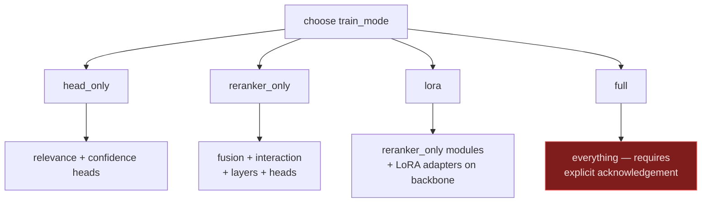
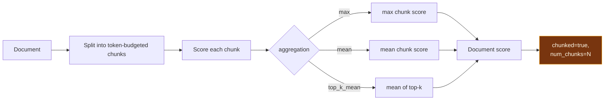

# Architecture

## The one-sentence version

EmbeddingGemma 2's text tower is frozen and reused as a shared feature extractor;
everything that actually decides relevance — fusion, token interaction, reranker
blocks, heads — is new trainable code sitting on top of it.

## Main pipeline



## Retrieval vs reranking

The distinction matters, because a reranker that only wraps cosine similarity is
not a reranker.

```mermaid
flowchart LR
    subgraph BE["Embedding retrieval (bi-encoder)"]
        Q1[Query] --> E1[Encoder]
        E1 --> VQ[768-d vector]
        D1[Doc] --> E2[Encoder]
        E2 --> VD[768-d vector]
        VQ --> COS[Cosine similarity]
        VD --> COS
        COS --> R1[Score]
    end

    subgraph RR["Reranking (cross-encoder)"]
        Q2[Query] --> ENC[Shared backbone]
        D2[Doc] --> ENC
        ENC --> FUSE[Fusion<br/>Q, D, Q⊙D, |Q−D|]
        FUSE --> LAYERS[Reranker layers]
        LAYERS --> HEAD[Relevance head]
        HEAD --> R2[Score]
    end
```

| | Embedding retrieval | Reranking |
|---|---|---|
| Encoding | Query and document **independently** | Query and document **jointly** |
| Representation | One vector per item | Token states + pooled + fused features |
| Interaction | Fixed similarity function | Learned, token-level |
| Cost per document | Amortized, indexable | Must re-run per (query, document) pair |
| Position | Stage 1, over the whole corpus | Stage 2, over ~50–200 candidates |

This project implements **both**: `evaluation/baseline.py` for stage 1,
`embeddinggemma_reranker/` for stage 2.

## Module map



## Data flow through one forward pass



Note the **query is encoded once** and tiled across candidates. That is what keeps
a cross-encoder affordable.

## Interaction mechanisms

`fusion.interaction_type` selects the mechanism:

| Value | Features fed to the projection | Cost |
|---|---|---|
| `none` | `Q + D` | lowest |
| `concatenate` | `[Q, D]` | low |
| `elementwise` | `[Q, D, Q⊙D, |Q−D|]` (default) | low |
| `dot` | `[cos(Q,D), Q, D]` | low |
| `token` | plus cross-attention context and an interaction matrix | `O(T_q · T_d)` |

```mermaid
flowchart LR
    Q[Q] --> F
    D[D] --> F
    Q --> M1[Q ⊙ D]
    D --> M1
    Q --> M2-abs[|Q − D|]
    D --> M2-abs
    F[Q] --> PROJ[Fusion projection]
    D --> PROJ
    M1 --> PROJ
    M2-abs --> PROJ
    PROJ --> RR[Ranking representation]

    style RR fill:#065f46,stroke:#10b981,color:#ecfdf5
```

## Reranker layer



Pre-norm with a residual connection, repeated `num_reranker_layers` times.

## Training modes



`full` is never selected automatically; it raises `FullFinetuneNotConfirmed`
unless the caller passes `allow_full_finetune=True`.

## Chunk aggregation for long documents



Truncation is always reported. A long document is never silently clipped.

## What is and is not changed in the checkpoint

| Component | Changed? |
|---|---|
| Text tower hidden size (512) | no |
| Text tower layer count (24) | no |
| Attention heads (4) / KV heads (2) | no |
| Vocabulary (262 144) | no |
| Tokenizer | no |
| Vision / audio encoders | not loaded |
| Fusion / interaction / reranker / heads | **new** |

The original checkpoint therefore stays load-compatible. See
`docs/source_model_analysis.md` for the verified values this table refers to.

## Honest status

The architecture above is implemented. What it **is not** yet: a trained model.
No reranker checkpoint has been trained or benchmarked in this repository, so no
claim is made that it beats EmbeddingGemma retrieval. Run
`scripts/evaluate_reranker.py` after training to find out.
